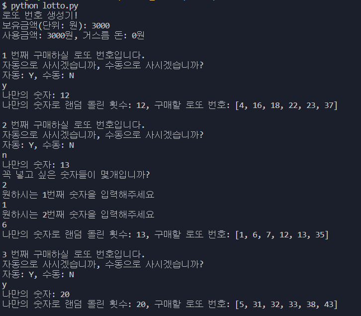
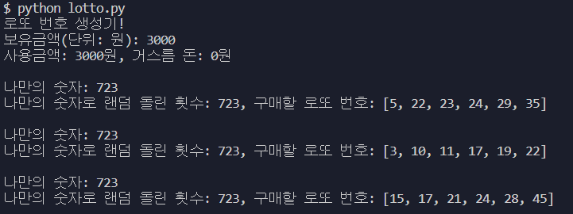

# 💰 로또 번호 생성기 💸

## 📄 소개

> 한번의 랜덤 함수로는 아쉽다!
>
> 나만의 숫자를 입력해서 그 숫자만큼 랜덤 함수를 돌려서 가장 빈도수가 높은 6개 숫자를 뽑아주는 생성기라면 운명을 내가 정할 수 있지 않을까?

## 📄 사용 방법

### 사용 예시 사진

### ✔ Version 1_1 (자동/수동 구별 추가)

1. 현재 자신의 **보유 금액**을 입력한다.
2. **보유 금액**만큼 로또 번호를 생성할 수 있다.(ex: 3,000원 입력 시 3번의 로또 번호를 생성해줌)
3. **자동/수동**을 구별하기 위해 자동은 `'Y', 'y'`를 수동은 `'N', 'n'`을 입력하여 구별한다.
4. **나만의 숫자**를 입력한다.
5. **자동의 경우** 
   1. 자동으로 **나만의 숫자**를 통해 구매할 로또 번호가 생성된다.
6. **수동의 경우**
   1. **내가 넣고 싶은 숫자의 개수**를 입력한다.
   2. 원하는 개수의 숫자만큼 **넣고 싶은 숫자를 입력**한다.
   3. **원하는 숫자와 나만의 숫자**를 통해 구매할 로또 번호가 생성된다.

### Version 1 (초안)

1. 현재 자신의 보유 금액을 입력한다.
2. 보유 금액만큼 로또 번호를 생성할 수 있다.(ex: 3,000원 입력 시 3번의 로또 번호를 생성해줌)
3. 로또 번호는 **나만의 숫자**를 입력했을 때 그 횟수만큼 랜덤 함수가 반복되며 랜덤 함수로 만들어진 로또 번호를 누적하여 나만의 숫자만큼 반복했을 때 **가장 누적 수가 높은 6개의 숫자**로 최종 로또 번호가 만들어진다.